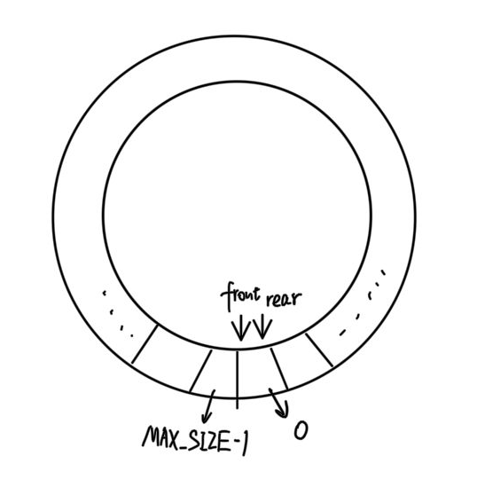
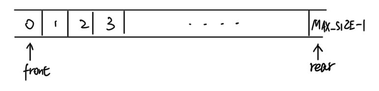

<center><font size=7>实验一：熟悉C#语法和VS编程环境</font>

---
# 实验描述

2.1用C#构造一个队列Queue。要求此队列是循环队列，并进行入队、出队的测试。

个人经过测试，此代码可满足数据大小小于$2^{32}-1$的循环队列测试，具体操作如下

---
# 循环队列支持的操作

```c#
CQueue circle_queue = new CQueue(MAX_SIZE);
//CQueue为定义的类名，circle_queue为创建的一个循环队列对象，MAX_SIZE为循环队列的最大长度（1~4294967295）
```

## 队列清空操作

```C#
circle_queue.Clear();
//清空队列中所有元素
```

## 判断队列是否为空

```c#
circle_queue.Empty();
//boolean类型，若队列为空返回true，否则返回false
```

## 返回队列的长度

```C#
circle_queue.Length();
```

## 返回头元素（不出队）

```C#
circle_queue.Gtehead();
```

## 插入元素

```c#
circle_queue.put(int item);
//向队尾插入一个int类型的元素
```

## 出队

```C#
circle_queue.Poll();
```

---
# 实现过程

循环队列与普通队列的区别在于其可以将空间最大利用，我们可以将其看成一个环状结构，如下图：



循环队列初始化后队首队尾位置都为0，最大位置下标为MAX_SIZE - 1

在实现循环队列时所使用的基本数据结构还是数组，但是对数组下标位置上做了一些处理：



当队尾元素和队首元素位于数组的最后一个位置时（这里以队尾位于数组最后一位时举例），要知道如果rear继续加1，数组就会越界，就无法实现循环这种操作。我们对每一次下标变化采取如下操作：

```C#
rear = (rear + 1) % maxsize;
```

此操作可以确保队尾队首位置索引值不会超过数组的最大长度，而且在达到最大值时可以返回数组的第一个位置。

具体代码如下：

```c#
using System;

namespace homework1
{
    public class CQueue
    {
        private int[] data; //用于储存队列数据的数组
        private int maxsize; //队列所能储存元素的最大容量
        private int front; //队头元素的位置索引
        private int rear; //队尾元素的位置索引
        private uint length;

        public CQueue(int size)  //构造函数,队列的初始化
        {
            data = new int[size];
            maxsize = size;
            front = rear = 0;
            length = 0;
        }

        public void Clear() //清空该队列
        {
            front = rear = 0;
            length = 0;
        }

        public bool Empty() //若队列为空，则返回1，否则返回0
        {
            if(front == rear) return true;
            else return false;
        }

        public uint Length() //返回队列长度
        {
            return length;
        }

        public int GetHead() //若队列不空则返回头元素
        {
            if(Empty())
            {
                Console.WriteLine("队列为空，请添加元素");
                return -1;
            }
            else return data[front];
            
        }

        public void Print() //打印队列中内容
        {
            int i = front;
            while(i != rear)
            {
                Console.WriteLine(data[i]);
                i = (i + 1) % maxsize;
            }
        }

        public void Put(int item) //向队尾插入元素
        {
            if(Length() == maxsize)
            {
                Console.WriteLine("队列已满，无法添加元素");
                return;
            }
            data[rear] = item;
            rear = (rear + 1) % maxsize;
            length++;
        }

        public int Poll() //若队列不空则返回并删除队头元素
        {
            if(Empty())
            {
                Console.WriteLine("队列为空，请添加元素");
                return -1;
            }
            else
            {
                int tmp = front;
                front = (front + 1) % maxsize;
                length--;
                return data[tmp];
            }
        }
    }
    class Program
    {
        static void Main(string[] args)
        {
            CQueue cque = new CQueue(1000); //请在括号内输入队列的大小
            //输入队列的相关操作
            


            
        }
    }

}
```
