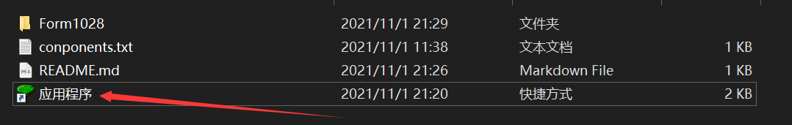
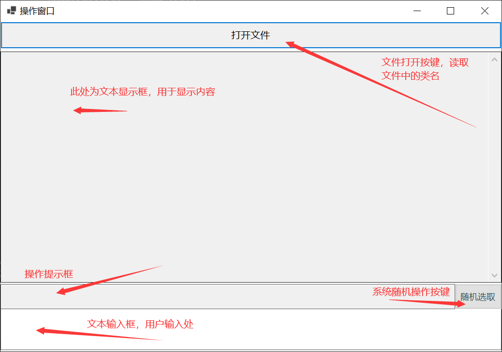
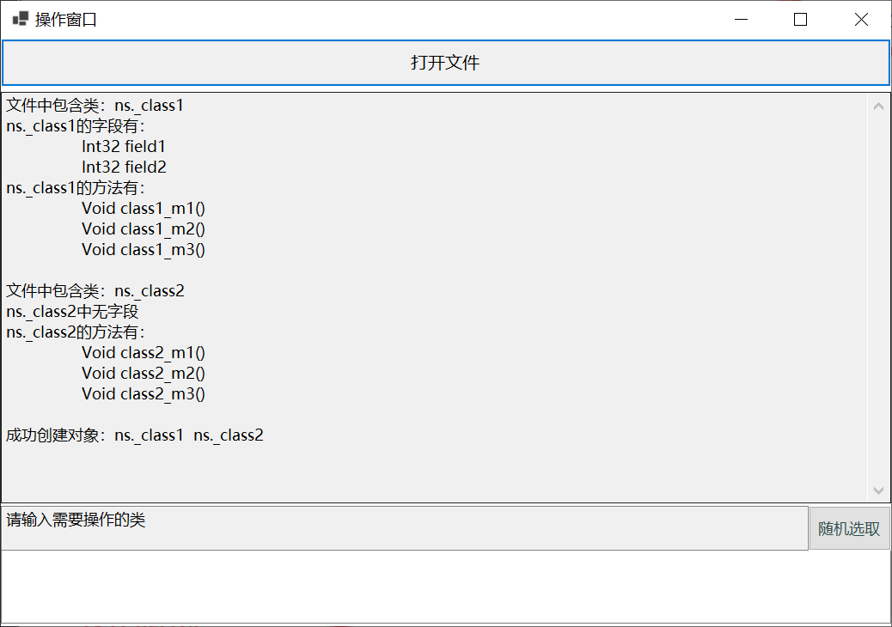
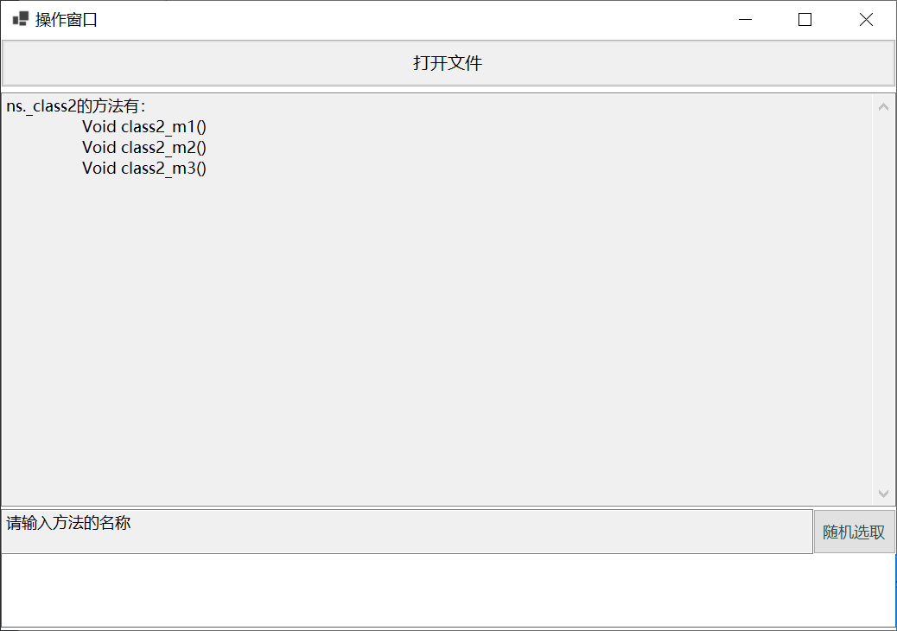
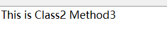

<center><font size=7>实验三：面向对象和C#语言特性</font></center>

# 实验目的

构建一个components.txt文件，每行代表一个类（比如形状类Shape）的名字（这些类可以来自系统库，或者自己构造）；程序逐行扫描该文件，构建对应的类的对象。

实验要求：

1. 把这些对象放到数组中；
2. 列出每个类的字段、方法；
3. 让用户选择，使得用户可以调用所需要的方法或者操作
4. 系统随机选择对象（比如形状），随机的执行其操作，从而看系统演化。可能的话，**进行界面展示**

# 实验流程

## 创建实验环境

与实验二一致

## 实验原理

1. 根据要求一，我们需要读取components.txt文件，所以第一需要进行文件的创打开和读取

```C#
//文件的打开和读取
FileStream F = File.Open(filename, FileMode.Open, FileAccess.Read, FileShare.Read);
//读取流
StreamReader sr = new StreamReader(F);
```

之后需要读取文件中的类名，并创建实例，在这里使用了图形化的操作界面，之后创建出的实例添加到对象数组list里

```c#
while (sr.Peek() > -1)
{
    string str = sr.ReadLine();
    Type type = assembly.GetType($"ns.{str}");

    //创建类的实例
    object obj = Activator.CreateInstance(type);
    list.Add(obj);
}
```

2. 读取每个类中的字段和方法，并打印出来（在名为showtext的文本框中）

```c#
FieldInfo[] fields = type.GetFields();
MethodInfo[] methods = type.GetMethods();

//字段
if (fields.Length > 0)
{
    showtext.AppendText($"{type}的字段有：\r\n");
    foreach (FieldInfo field in fields)
    {
        showtext.AppendText("\t" + field + "\r\n");
    }
}
else showtext.AppendText($"{type}中无字段\r\n");

//方法
if (methods.Length > 0)
{
    showtext.AppendText($"{type}的方法有：\r\n");
    for (int i = 0; i < methods.Length - 4; i++) //不打印继承的方法
    {
        showtext.AppendText("\t" + methods[i] + "\r\n");
    }
}
else showtext.AppendText($"{type}中无方法\r\n");
```

3. 要求三需要根据用户的需求进行对象的选择需要操作的类和方法，这里采用在文本框中输入类名（回车输入），方法名（空格输入）

```C#
if (ch == '\r')
{
    string info = operationtext.Text;	//保存文本框中输入的信息并清空
    operationtext.Clear();
    try     //这里使用了try/catch的错误处理机制 防止程序崩溃 可以一直操作
    {
        type_info = assembly.GetType($"ns.{info}");		//通过类名获取类型
        MethodInfo[] methods = type_info.GetMethods();		//获取类型中的方法
        obj = Activator.CreateInstance(type_info);
        showtext.Clear();
        if (methods.Length > 0)
        {
            showtext.AppendText($"{type_info}的方法有：\r\n");
            for (int i = 0; i < methods.Length - 4; i++)
            {
                showtext.AppendText("\t" + methods[i] + "\r\n");
            }
        }
        else showtext.AppendText($"{type_info}中无方法\r\n");
        showtext.AppendText("\r\n");
        remindTextBox.Text = "请输入方法的名称";

    }
    catch
    {
        MessageBox.Show("输入的类名不存在，请重新输入");
    }
}

else if (ch == ' ')		//调用类中的方法
{
    method_info = operationtext.Text;		//获取输入的方法名
    operationtext.Clear();
    try
    {
        MethodInfo method = type_info.GetMethod(method_info);		//通过方法名获取方法 并进行调用
        method.Invoke(obj, null);
        showtext.Text = show_text;
        remindTextBox.Text = "请输入需要操作的类";
    }
    catch
    {
        MessageBox.Show("输入的方法不存在，请重新输入");
    }
}
}
```

4. 进行系统的随机选择， 这里是根据文件中的类名的个数和类中方法的个数随机生成一个随机数，通过随机数进行类和方法的调用

# 实验结果（成果展示）

1. 打开应用程序



2. 操作窗口展示



3. 打开components文件（文件中内容为两行，分别为 _class1,  _class2），打印文件中的类的信息



4. 在用户操作框中输入类名并按下回车，显示该类中的方法名，并提示用户输入方法名



5. 输入方法名，并执行操作



6. 若是随机选取，直接按下按钮即可，然后会在用户操作框中打印结果。
