<center><font size=7>实验二：图形化编程练习</font>

---

# 实验目的

 根据C#的图形化用户设计来构造个性化的**记事本/日记本**，可以进行文字编辑（不要求保存）；

## 功能需求

* 能够进行文字的编辑(包括文字颜色和字体的更改)
* 能够将编辑的文字进行保存
* 能够打开文件进行编辑

---

# 实验流程

## 创建实验环境

本实验使用Visual Studio 2019环境进行程序的设计与编写

1. 新建一个Windows窗体应用项目，目标框架为.NET Core 3.1

2. 添加工具栏（ToolStrip）和按钮（button）

    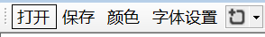

3. 设置工具栏和与按钮的属性

    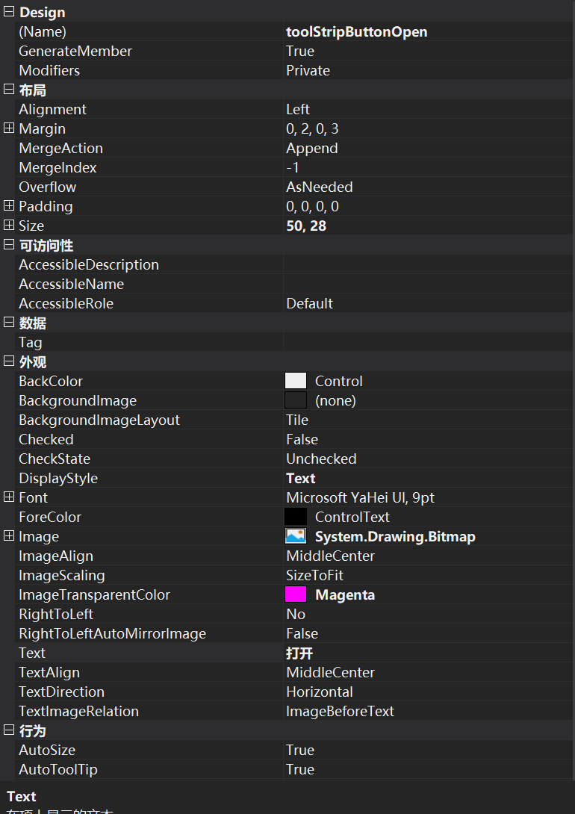

4. 添加富文本框（RichTextBox）并进行属性设置

    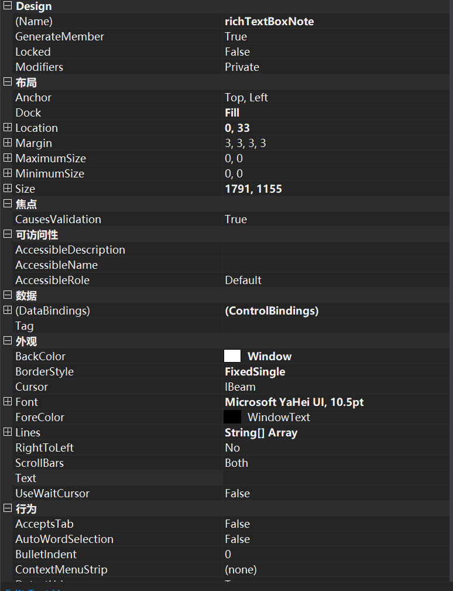

5. 添加openFileDialog、saveFileDialog、fontDialog、colorDialog并与button_Click事件关联

    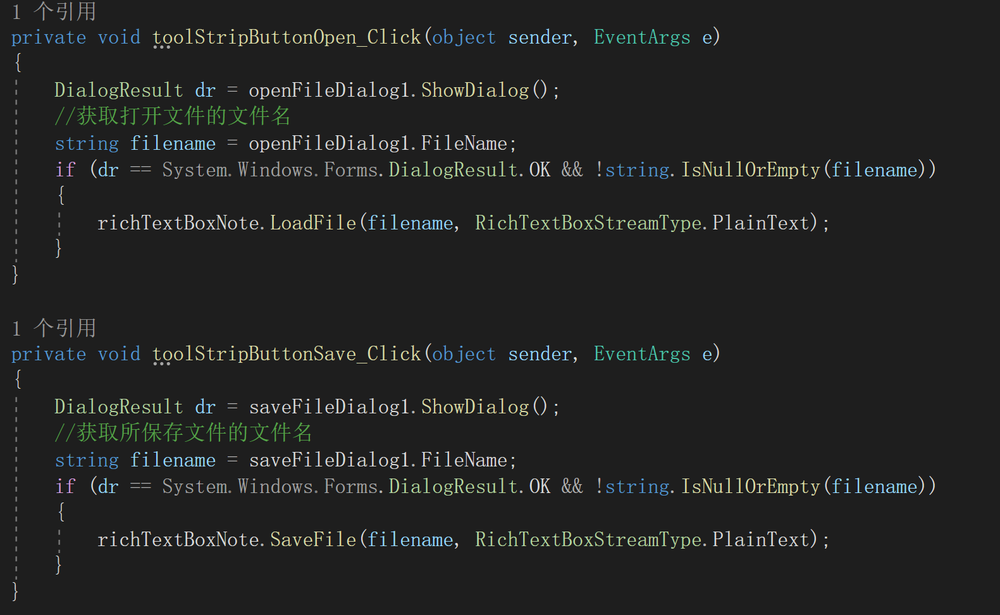

    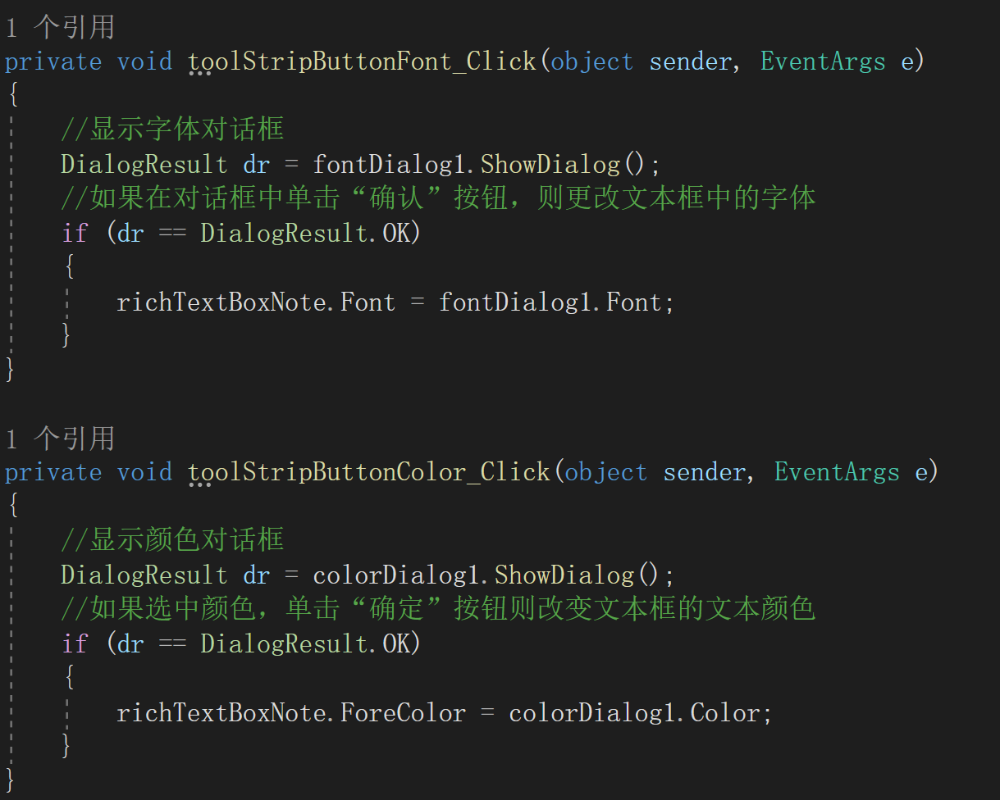

    ## 实验测试

    1. 文本的编辑

        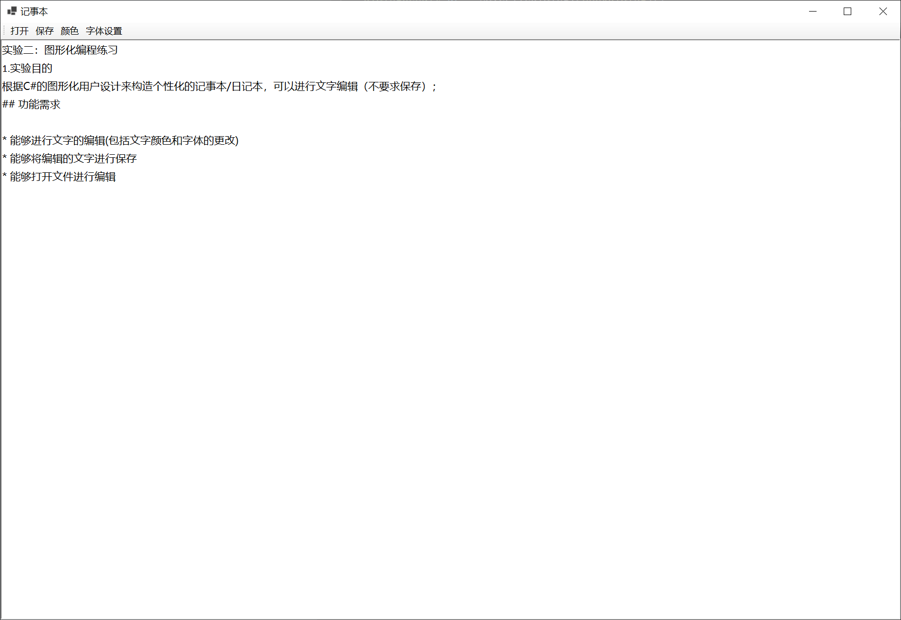

    2. 文本的颜色更改和字体更改

        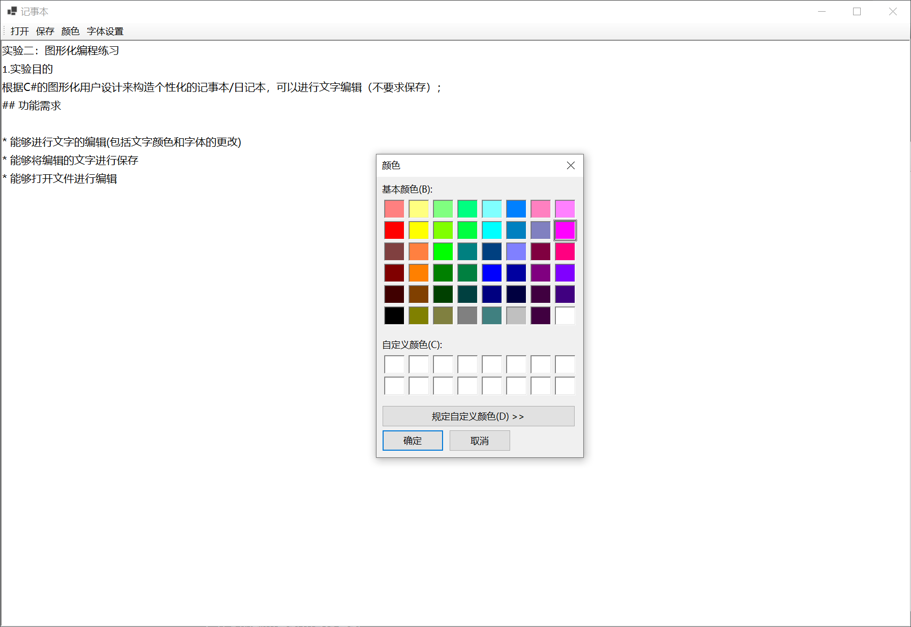

        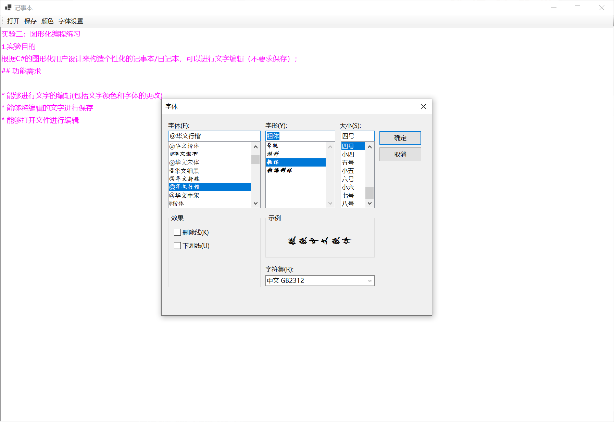

	    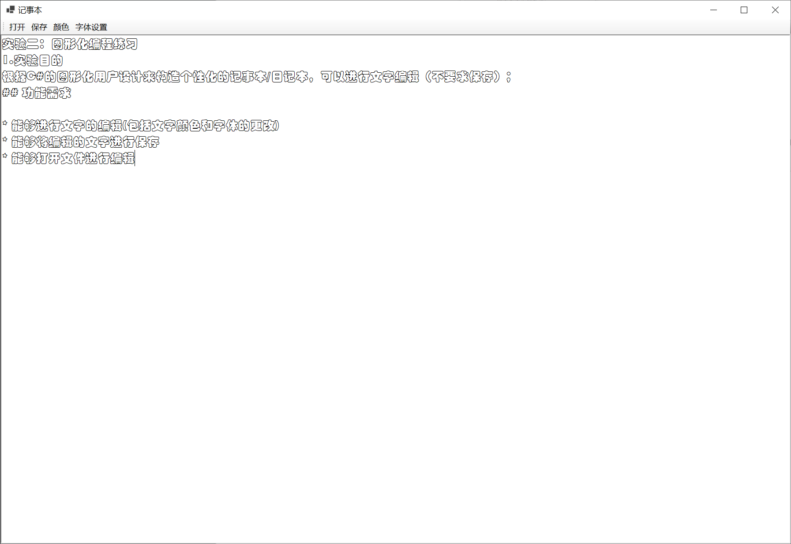
	
	    
	
	3. 文件的保存
	
	    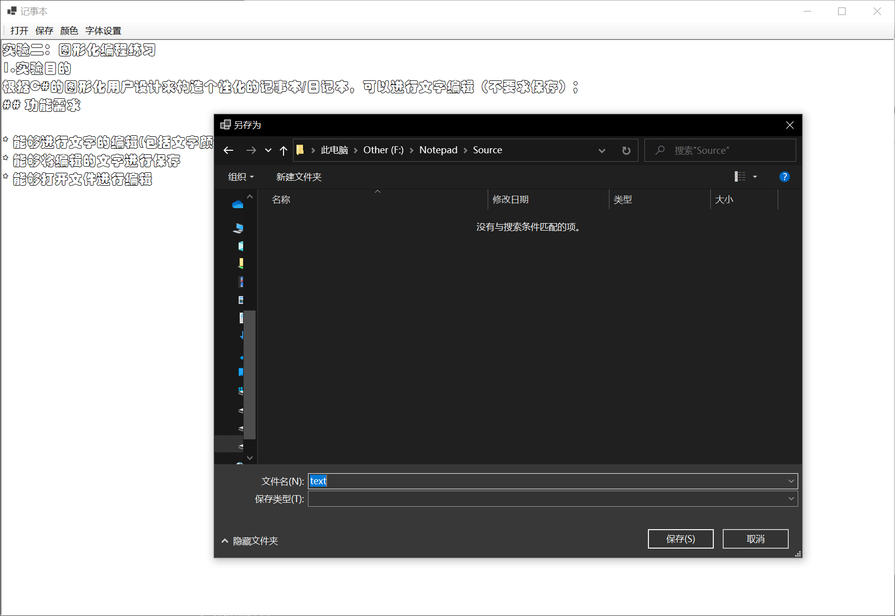
	
	4. 文件的打开
	
	    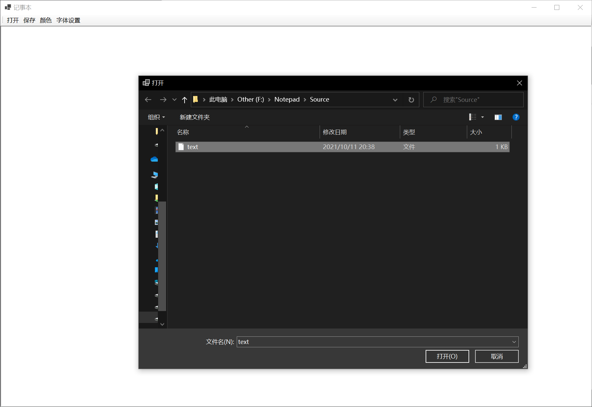
	
	    

# 代码实现

```c#
using System;
using System.Collections;
using System.Drawing;
using System.Drawing.Text;
using System.Windows.Forms;

namespace Notepad
{
    public partial class Form1 : Form
    {
        public Form1()
        {
            InitializeComponent();
        }

        //窗体加载事件
        private void Form1_Load(object sender, EventArgs e)
        {
            
        }

        private void toolStripButtonOpen_Click(object sender, EventArgs e)
        {
            DialogResult dr = openFileDialog1.ShowDialog();
            //获取打开文件的文件名
            string filename = openFileDialog1.FileName;
            if (dr == System.Windows.Forms.DialogResult.OK && !string.IsNullOrEmpty(filename))
            {
                richTextBoxNote.LoadFile(filename, RichTextBoxStreamType.PlainText);
            }
        }

        private void toolStripButtonSave_Click(object sender, EventArgs e)
        {
            DialogResult dr = saveFileDialog1.ShowDialog();
            //获取所保存文件的文件名
            string filename = saveFileDialog1.FileName;
            if (dr == System.Windows.Forms.DialogResult.OK && !string.IsNullOrEmpty(filename))
            {
                richTextBoxNote.SaveFile(filename, RichTextBoxStreamType.PlainText);
            }
        }

        private void toolStripButtonFont_Click(object sender, EventArgs e)
        {
            //显示字体对话框
            DialogResult dr = fontDialog1.ShowDialog();
            //如果在对话框中单击“确认”按钮，则更改文本框中的字体
            if (dr == DialogResult.OK)
            {
                richTextBoxNote.Font = fontDialog1.Font;
            }
        }

        private void toolStripButtonColor_Click(object sender, EventArgs e)
        {
            //显示颜色对话框
            DialogResult dr = colorDialog1.ShowDialog();
            //如果选中颜色，单击“确定”按钮则改变文本框的文本颜色
            if (dr == DialogResult.OK)
            {
                richTextBoxNote.ForeColor = colorDialog1.Color;
            }
        }
    }
}

```

# 实验收获

此次实验考查了C#图形化编程的相关知识，与书本上第9章 Windows窗体应用程序设计和第10章 用户界面设计有关。除此之外实验的完成也搜集了很多课外的资料。[C# 图形化编程参考](http://c.biancheng.net/view/2980.html)

