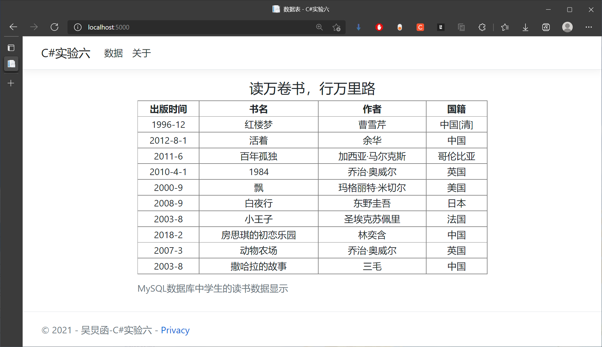
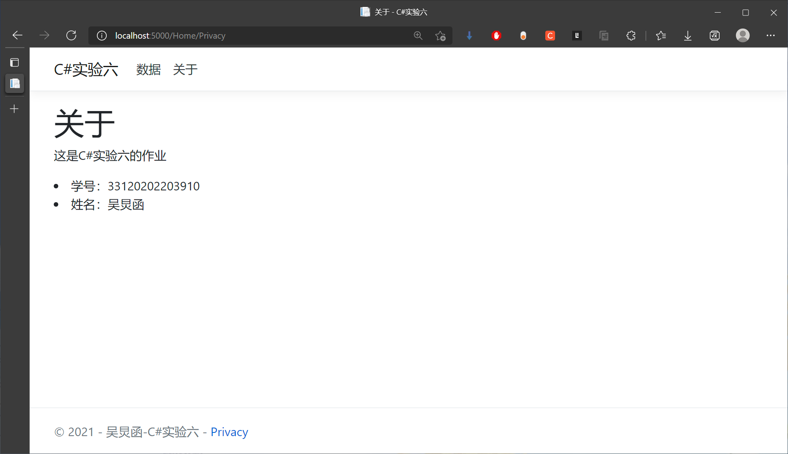
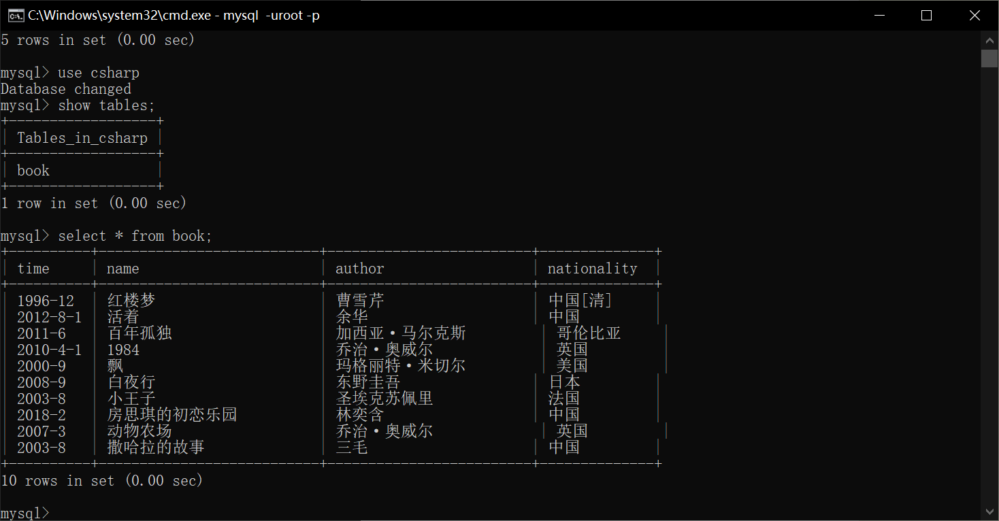
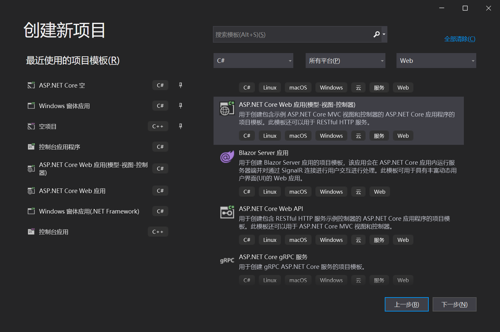
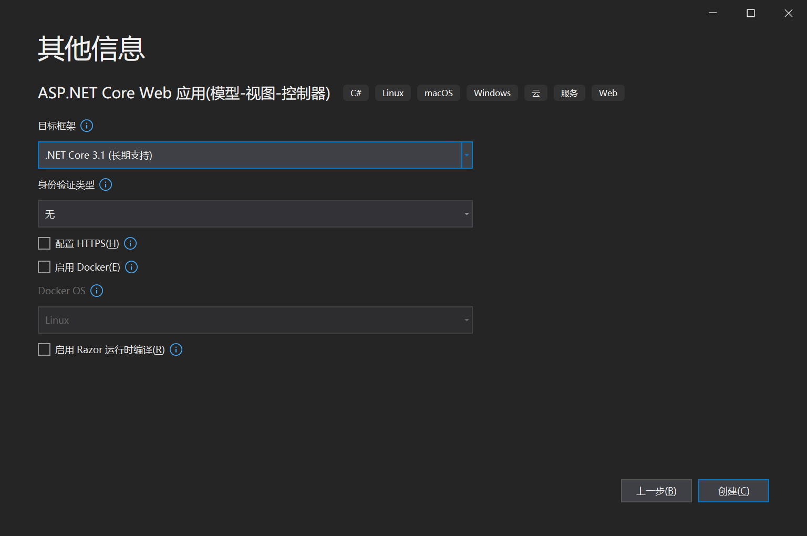

<center><font size=6>C#实验六：数据库和网页编程</font></center>

效果图：





# 实验目的

1. 基于Access数据库或者Mysql数据库，构建学生表、图书表、电影表，学生借阅表、学生-电影表，并手动输入数据。或者编程导入数据。

各表自己定义，可以是一个表格或多个表格。需要仔细定义字段。

> access/mysql等数据库的基本操作，请自行检索。
>
> https://www.guru99.com/ms-access-tutorial.html
>
> https://www.w3cschool.cn/mysql/

2. 熟悉关系型数据库的基本操作和查询语句。

3. 了解html、css、JavaScript等前端的基本内容。

# 实验要求

基于Asp.Net Core进行网页编程，从数据库中读取学生看书的数据，并展示到网页中。要求先展示列表，然后点击具体项目，进行展示。可进行一定的数据汇总。

# 实验流程

## 创建实验环境

### 安装MySQL数据库

版本号为8.0.27 [安装教程](https://blog.csdn.net/a802976/article/details/119255644?ops_request_misc=%7B%22request%5Fid%22%3A%22164160305216780265449529%22%2C%22scm%22%3A%2220140713.130102334..%22%7D&request_id=164160305216780265449529&biz_id=0&utm_medium=distribute.pc_search_result.none-task-blog-2~all~top_positive~default-2-119255644.first_rank_v2_pc_rank_v29&utm_term=mysql安装配置教程&spm=1018.2226.3001.4187) 

### 创建数据表

这里偷懒使用Pycharm自带的MySQL工具生成所需的数据，避免了命令行输入代码的形式。

所创建的数据表如图所示



### 建立ASP.NET Core WebApp MVC项目





## 实验步骤

### 建立数据库连接

HomeController.cs 控制器

```C#
// 储存数据库中字段信息的Book类
public class Book
    {
        public string time;  //储存书籍的出版时间
        public string name;  //储存书籍名
        public string author;  //储存书籍作者
        public string nation;  //储存作者的国籍
        public Book(params string[] strs)
        {
            time = strs[0];
            name = strs[1];
            author = strs[2];
            nation = strs[3];
        }
    }

// Index页面的控制器代码
public IActionResult Index()
{
    List<Book> lists = new List<Book>();
    string connectString = "data source=localhost;database=csharp;user id=root;password=020406;pooling=true;charset=utf8;";  // 数据库连接字符串
    using (MySqlConnection msc = new MySqlConnection(connectString))
    {
        MySqlCommand myCmd = new MySqlCommand("select * from book", msc); // 数据库操作指令，选择所有书籍
        msc.Open();
        MySqlDataReader reader = (MySqlDataReader)myCmd.ExecuteReader();
        //读取数据库中所有的信息，并进行储存
        while(reader.Read())
        {
            if(reader.HasRows)
            {
                lists.Add(new Book(reader.GetString(0), reader.GetString(1), reader.GetString(2), reader.GetString(3)));
            }
        }
    }
    ViewBag.lists = lists;
    return View();
}
```

### 页面加载View

Index.cshtml

```html
@{
    ViewData["Title"] = "数据表";
}

<div class="text-center">
    <h4>读万卷书，行万里路</h4>
    <table width="600" frame="box" rules="all" border="1" align="center">

        <caption>MySQL数据库中学生的读书数据显示</caption>

        <tr>
            <th>出版时间</th>
            <th>书名</th>
            <th>作者</th>
            <th>国籍</th>
        </tr>
        @foreach (var stakerholder in ViewBag.lists)
        {
            <tr>
                <td>@stakerholder.time</td>
                <td>@stakerholder.name</td>
                <td>@stakerholder.author</td>
                <td>@stakerholder.nation</td>
            </tr>
        }
    </table>
    
</div>
```

之后顺便修改几个其他信息就完成了这个项目。最后结果在最上面。
