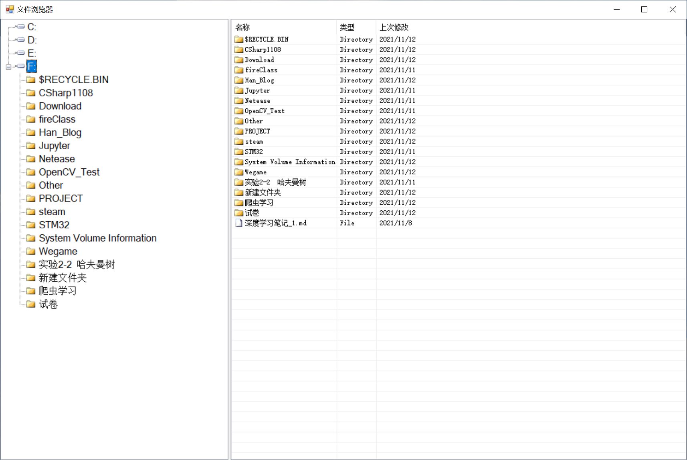
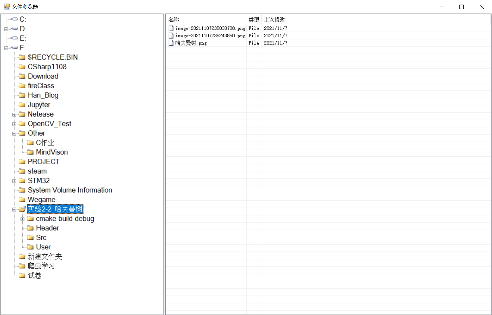

<center><font size=7>实验四：图形化编程进阶</font></center>

# 实验目的

仿照windows的文件浏览器，编写一个树状视图的文件浏览器。

要求：注意用到课本所列举的一些高级控件。

# 实验流程

## 创建实验环境

与实验二一致

## 实验原理

要做到文件浏览的功能，第一想法就是采用树形视图控件(TreeView)和列表视图控件(ListView)。

树形视图用于显示所有磁盘和文件夹下的内容，可以展示文件夹内包含的文件夹，而列表视图控件用于展示文件夹内具体的所有文件。

其次还需要实现的操作有

### 获取所有的磁盘

```c#
private void EnumAllDrives()
        {
            foreach(string  MyDrive in Directory.GetLogicalDrives())
            {
                    TreeNode RootNode = new TreeNode();
                   
                    RootNode.Text = MyDrive.Substring(0,MyDrive.Length-1);
                    RootNode.Tag =MyDrive;
                    RootNode.ImageIndex = 0;
                    RootNode.ForeColor = Color.Black;
                    treeView1.Nodes.Add(RootNode);
            }
        }
```

### 获取选择路径下的所有文件夹

```c#
private void EnumAllFile(TreeNode ParNode)
        {
            string path = ParNode.Tag.ToString();
            if (path.Substring(path.Length-1)!=@"\")
            {
                path+=@"\";
            }
            if (ParNode.Nodes.Count!=0)//判断当前选中节点是否已有子目录
            {
                return;
            }
            try
            {
                string[] Folders = Directory.GetDirectories(path);
                if (Folders.Length==0)
                {
                    return;
                }
                treeView1.BeginUpdate();
                TreeNode SubNode;
                foreach (string MyFolder in Folders)
                {
                    SubNode= new TreeNode();
                    //取得文件名，不包含路径
                    SubNode.Text = MyFolder.Substring(path.LastIndexOf(@"\") + 1);
                    SubNode.ImageIndex = 2;
                    SubNode.SelectedImageIndex = 1;
                    //将路径名作为数据对象
                    SubNode.Tag = MyFolder;
                    ParNode.Nodes.Add(SubNode);  
                }
                treeView1.Select();
                treeView1.EndUpdate();
            }
            catch (System.Exception e)
            {
                MessageBox.Show("拒绝访问！");
                e.ToString();
            }
        }
```

### 选择节点并获取节点下文件夹

```c#
private void select(object sender, TreeNodeMouseClickEventArgs e)
        {
             EnumAllFile(e.Node);
        }
```

### 选择节点并获取节点下所有的文件

```c#
private void Show_File(object sender, TreeNodeMouseClickEventArgs e)
        {

             TreeNode newSelected = e.Node;
             listView1.Items.Clear();
             DirectoryInfo nodeDirInfo =new DirectoryInfo(newSelected.Tag.ToString());
             ListViewItem item = null;
             try
             {
                 listView1.BeginUpdate();
                 foreach (DirectoryInfo dir in nodeDirInfo.GetDirectories())
                 {
                     item = new ListViewItem(dir.Name);
                     item.ImageIndex = 2;
                     item.SubItems.Add("Directory");
                     item.SubItems.Add(dir.LastAccessTime.ToShortDateString());
                     listView1.Items.Add(item);
                 }
                 foreach (FileInfo file in nodeDirInfo.GetFiles())
                 {
                     item = new ListViewItem(file.Name);
                     item.SubItems.Add("File");
                     item.SubItems.Add(file.LastAccessTime.ToShortDateString());
                     item.ImageIndex = 3;
                     listView1.Items.Add(item);
                 }
             }
            //无权限访问
             catch (System.Exception Ex)
             {
                 Ex.ToString();
                MessageBox.Show("拒绝访问！");
             }
              listView1.AutoResizeColumns(ColumnHeaderAutoResizeStyle.HeaderSize);
              listView1.EndUpdate();
        }
```

# 实验结果（成果展示）

1. 磁盘下文件显示
    

2. 树形列表显示

    